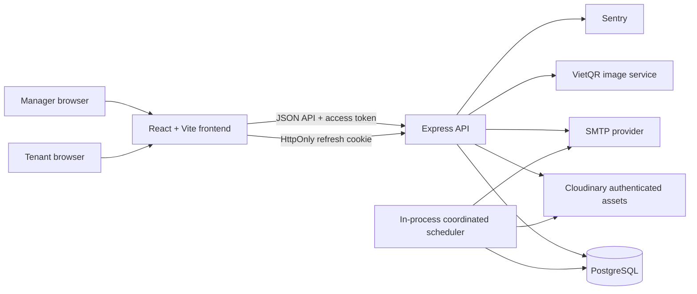
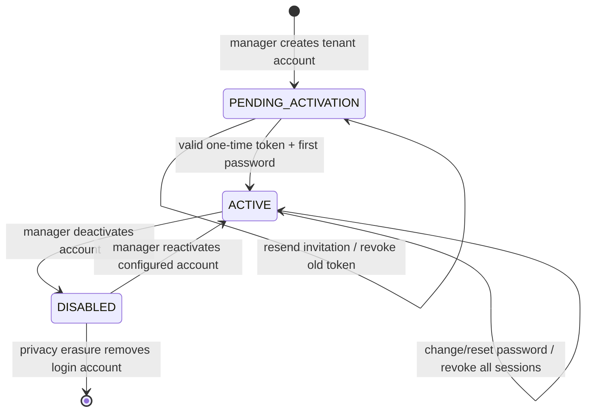
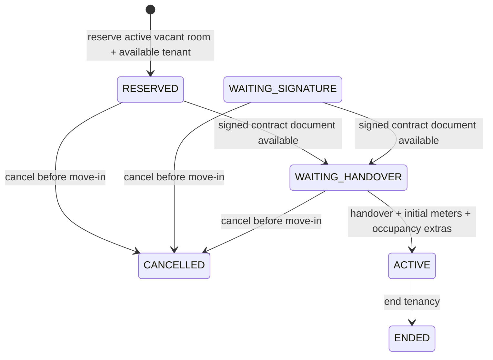
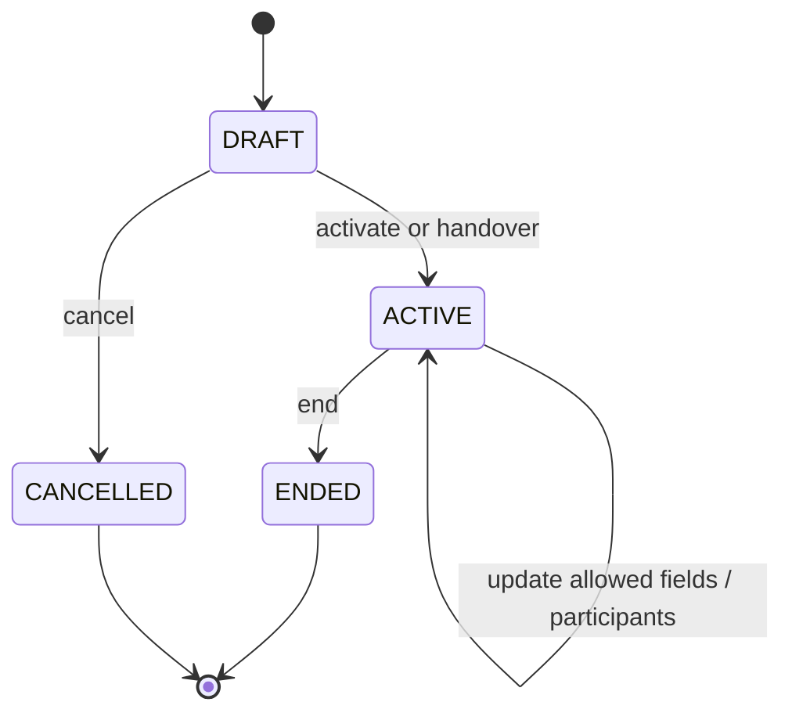
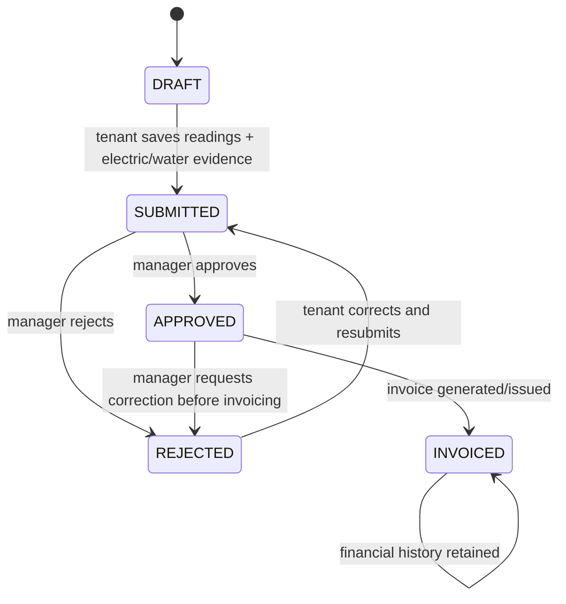
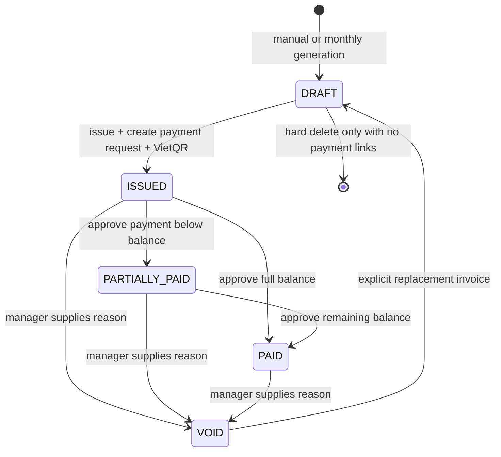
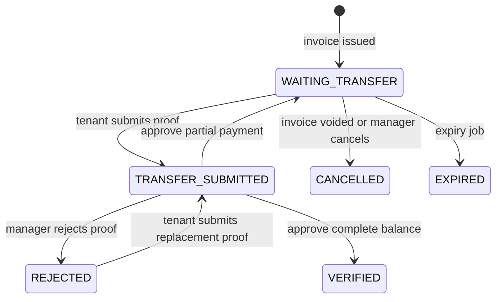
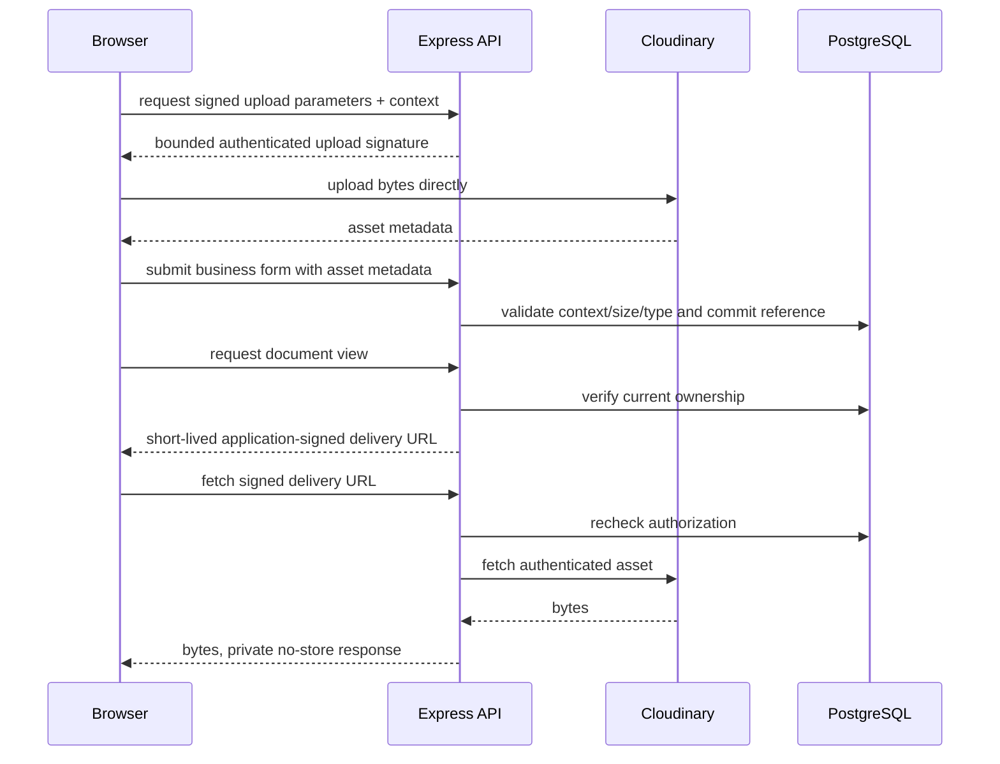

# System Architecture And Business Lifecycles

## System Context

The frontend is a first-party browser client. Express owns authentication,
authorization, validation, business rules, transaction orchestration, signed
document delivery, and integrations. PostgreSQL is the source of truth for
business and financial state. Cloudinary stores file bytes but never determines
authorization.

Backend modules follow `route -> service -> repository/database` boundaries.
Routes parse HTTP input and shape responses, services own state transitions and
transactions, and repositories own SQL where a module has enough query volume
to justify that split. Shared middleware provides authentication, error
contracts, request IDs, rate limits, audit context, logging, and security
headers.

## Authentication And Sessions

- Password login requires a non-empty password hash, `is_active=true`, and
  `account_status=ACTIVE`. Authentication failures use a generic response.
- Access tokens live in frontend memory and expire after about 15 minutes.
- An opaque refresh token is stored in an `HttpOnly` cookie. PostgreSQL stores
  only its HMAC hash, session family, expiry, revocation state, and bounded
  device metadata.
- Every refresh rotates the token. Reuse revokes the complete token family.
- Logout revokes one session. Password change/reset, account deactivation, and
  the revoke-all action increment `session_version` and revoke relevant rows.
- Activation and password-reset tokens are random, single-use, expiring values;
  only SHA-256 hashes are persisted.

## Rental Registration

Rental Registration is a guided workflow over a contract. Its presentation
stage is derived from the contract status, signed documents, and an internal
stage marker; it is not a second independent contract state machine.

`WAITING_SIGNATURE` remains a supported presentation marker for imported or
manually staged draft contracts; the current UI represents a new reservation as
`RESERVED` until its signed document is saved. Reservation creates a `DRAFT`
contract and primary tenant assignment inside one transaction. Documents can be
added later. Handover locks the room and contract,
checks room capacity and tenant conflicts, records initial utility readings and
person/vehicle counts, then activates the contract. A draft is cancelled;
an active contract is ended. Historical contracts and assignments are retained.

## Contract Lifecycle

Only `ACTIVE` contracts count as occupancy and permit tenant utility submission
or monthly invoice generation. Each room can have at most one active contract,
and each contract has at most one primary tenant. Tenant assignment dates keep
participant history.

## Utility Reading Lifecycle

One reading exists per room/month. Non-reset meter values cannot decrease.
Evidence is uploaded only when the form is submitted. Once financial history
uses a reading, voiding an invoice does not unlock or delete that history.

## Invoice And Payment Lifecycle

Approval appends an immutable successful `PAYMENT` ledger entry. Corrections
append one matching `REVERSAL`; successful entries are never updated or deleted.
Invoice paid amounts and reports derive net payment as payments minus reversals.
Proof approval locks the proof, request, and invoice and is idempotent.

## Authorization Model

| Resource | Manager | Tenant |
| --- | --- | --- |
| Buildings, rooms, tenant profiles, contracts | Only rows owned through `building.manager_user_id` or `tenant.manager_user_id` | No manager CRUD access |
| Utility readings | Managed rooms only | Active contract and own tenant account only |
| Invoices and payment requests | Managed building scope only | Invoices tied to own contract assignment only |
| Payment proofs | Review managed invoices | Submit/view only for own payable request |
| Private documents | Managed entity scope, checked when URL is issued and delivered | Own tenant/contract/invoice scope only |
| Audit/operations | Manager-scoped audit; manager operations endpoints | No access |

Authorization is reapplied in SQL and again when producing or consuming a
short-lived document URL. A UUID alone never grants access. Inactive and pending
accounts fail authentication middleware before resource checks.

## File Upload Lifecycle

Deletion commits database state first and enqueues Cloudinary cleanup. Durable
jobs retry failed deletes, enforce retention, and detect orphan assets and orphan
records. Sensitive URLs and Cloudinary identifiers are redacted from logs and
audit snapshots.

## Architectural Decisions

1. **PostgreSQL migrations are the schema source of truth.** Applied migration
   checksums are immutable; `database.sql` is generated only as an artifact.
2. **Transactions live in services.** Multi-write workflows lock contested rows
   and rely on database constraints plus idempotency keys for retry safety.
3. **Financial history is append-only after approval.** Issued invoices are
   voided, not deleted; approved payments are reversed, not edited.
4. **Refresh credentials use opaque rotation.** The browser cannot read the
   refresh cookie, and token reuse revokes the family.
5. **Sensitive files use authenticated delivery.** PostgreSQL metadata and API
   authorization govern access; permanent public URLs are not an access model.
6. **Background work is PostgreSQL-coordinated at current scale.** Advisory
   locks, unique run buckets, outbox dedupe, and `SKIP LOCKED` support multiple
   API replicas without adding a queue service prematurely.
7. **The current `/api` contract is first-party and unversioned.** External
   clients require `/api/v1` and the migration policy in `api-versioning.md`.
8. **UTC is the persistence and operational timezone; VND is the financial
   currency.** Presentation can localize dates, but overdue and reconciliation
   definitions remain deterministic.

See `business-rules.md`, `financial-reporting.md`, `data-retention-privacy.md`,
`database-migrations.md`, and `background-jobs.md` for detailed policies.
